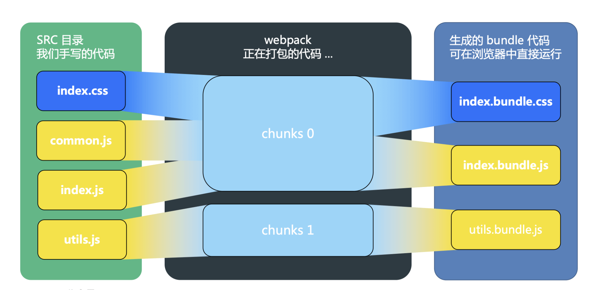

# 资源的输入和输出

### 带着问题：
在前面的所有例子中，我们都用到了`webpack.config.js`文件，里面简单写了`entry`这配置，本章就来重点关注`entry`和`output`

### 概念
module webpack中，每个文件都是一个模块
chunk 管理打包过程的文件
bundle 最终打包生成的文件，可以直接在浏览器中运行

vendor 供应商，第三方包

### entry & context 打包的开始

#### context

`context: string`

绝对路径；入口文件的路径前缀，用来标志入口文件所在位置，可以让entry更加简洁；可以不设置，但是建议设置。

#### entry

`entry: string | [string] | { <key> string | [string] } | Function`

### output

`output: object` 其中的key比较多，可以直接参考代码

