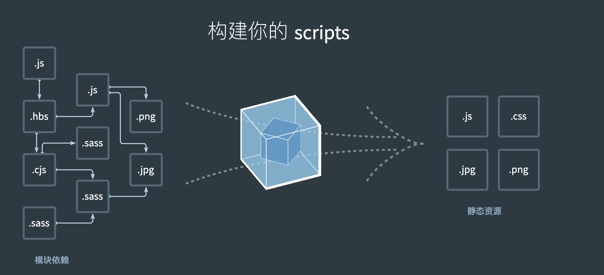
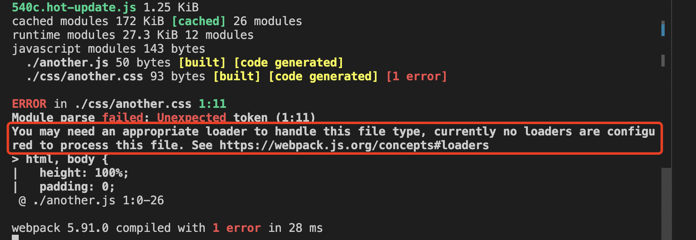
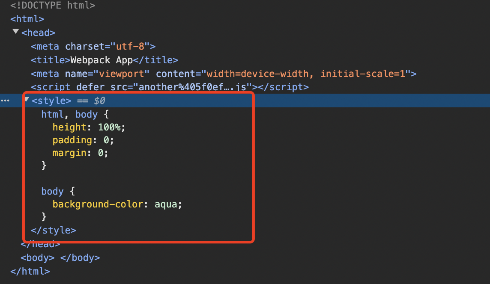

# 预处理器

### 带着问题：
前面三章，我们入门了webpack，但是webpack的功能远不止如此。在官网首页有这张图，


在webpack的世界里，一切都是模块，一切模块都可以被处理成bundle。
本章就来看看，webpack是怎么使用loader处理各种资源的？

### loaders

*webpack 只能理解 JavaScript 和 JSON 文件，这是 webpack 开箱可用的自带能力。loader 让 webpack 能够去处理其他类型的文件，并将它们转换为有效 模块，以供应用程序使用，以及被添加到依赖图中。*

#### 例子
先写一个例子，看看webpack怎么处理css的？

因为要处理依赖关系，所以直接js文件中引入css文件，这时候看到控制台报错了，

根据报错信息可以知道，需要一个合适的loader来处理这个css文件。
根据webpack文档找到[css-loader](https://webpack.docschina.org/loaders/css-loader/#root)，按照文档来配置，如下

```js
module: {
  rules: [
    {
      test: /\.css$/i,
      use: ['css-loader'],
    },
  ],
},
```

这时候重新启动，发现报错没有了。但是样式还是没有生效，原因：缺少`style-loader`，补全

```js
module: {
  rules: [
    {
      test: /\.css$/i,
      use: ['style-loader', 'css-loader'],
    },
  ],
},
```
样式文件以`<style>`标签的形式加载到html中，结果如下，


#### 配置

#### [module.rules.test](https://webpack.docschina.org/configuration/module/#ruletest)

正则，过滤出需要被处理的文件类型。

#### [module.rules.use](https://webpack.docschina.org/configuration/module/#ruleuse)

数组，支持链式调用，从右到左；use的loader还可以使用options传入配置项。

#### [module.rules.exclude](https://webpack.docschina.org/configuration/module/#ruleexclude)
#### [module.rules.include](https://webpack.docschina.org/configuration/module/#ruleinclude)

限定loader作用的范围，提升打包速度和效率。`exclude`优先级更高。

### 常用loaders

### 自定义loader
目标：写一个自定义组件，用来给模块加上严格模式；借此熟悉loader的运作方式。

目标2：模拟一个成熟的loader


